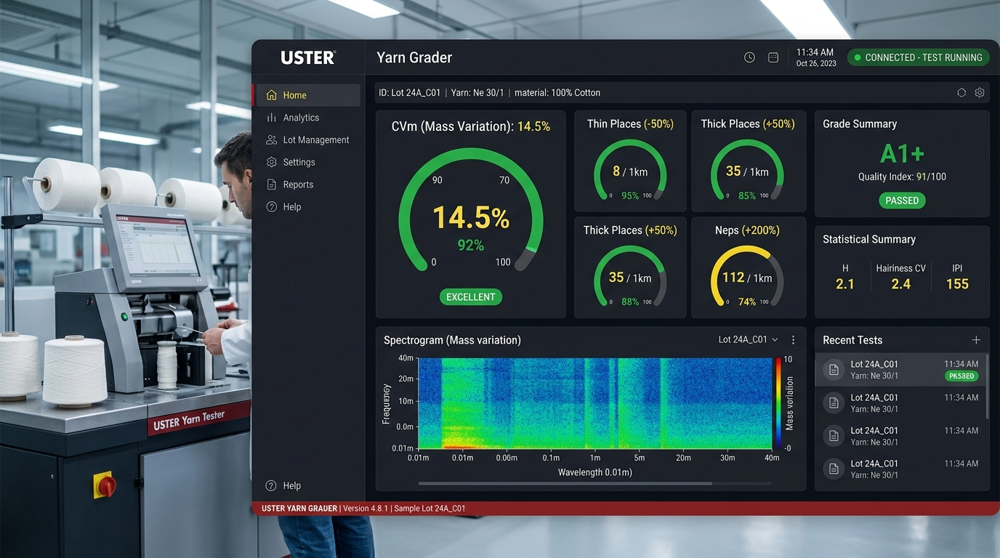
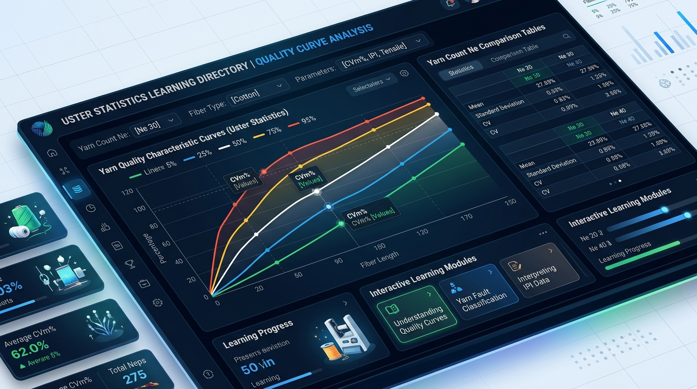
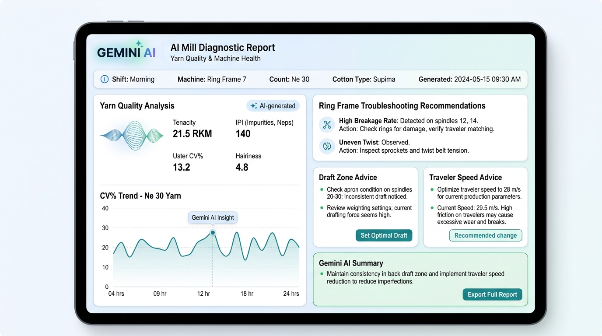

# 🧵 Uster Yarn Grader — Benchmark & Quality Analysis Engine

An AI-powered, industrial-grade quality control and benchmark grading platform for the global textile spinning industry. Built to instantly grade yarn test lots against world-recognized **Uster Statistics** standards, extract metrics from lab report PDFs/images using Gemini AI OCR, and deliver actionable mill machinery diagnostic reports.

---

## 🌐 Live Deployed Application

🚀 **Live Production App**: [https://ais-pre-6wu4yxln3bxpq4bdhysijp-201255155767.asia-southeast1.run.app](https://ais-pre-6wu4yxln3bxpq4bdhysijp-201255155767.asia-southeast1.run.app)

---

## 📌 Problem & Target Audience

### The Real Problem
In modern textile manufacturing, spinning mills, quality control laboratories, and international yarn trading houses must continuously evaluate whether cotton yarn lots meet strict buyer specifications. Traditionally, QC managers manually reference dense physical Uster Statistics handbooks or spreadsheets to compare complex metrics like mass variation ($CV_m$), thin places, thick places, neps, and hairiness ($H$). 

Manual grading is:
* **Time-consuming & Error-Prone**: Looking up linear interpolations for non-standard counts ($Ne$) across various percentiles ($5\%$, $25\%$, $50\%$, $75\%$, $95\%$) takes valuable time.
* **Lacks Context Calibration**: Raw metrics vary drastically depending on whether yarn is tested at the cop/bobbin stage or after winding on cones, or whether it is soft-spun for hosiery (knitting) versus high-twist for weaving.
* **Lacks Immediate Diagnostic Action**: Raw numbers don't tell mill managers *why* a lot is at $75\%$ $CV_m$ or what machine adjustment (cot hardness, traveler speed, carding gauge) is needed to fix it.

### Target Audience
* **Textile Quality Control Engineers & Mill Managers**
* **Spinning Technologists & R&D Teams**
* **Yarn Merchants, Export Brokers & Sourcing Agents**
* **Textile Engineering Students & Researchers**

---

## 📸 Screenshots in Action

| Main Laboratory Grading Dashboard | Interactive Uster Statistics Learning Hub |
| :---: | :---: |
|  |  |

| Gemini AI OCR Document Scanner & Mill Diagnostic Report |
| :---: |
|  |

---

## ✨ Features & Capabilities

### 1. Complete Quality Parameter Grading
Grading for all standard Uster Tester parameters:
* **Mass Homogeneity**: $CV_m$, $CV_m (1m)$, $CV_m (3m)$, Between-Bobbin $CV_b(CV_m)$.
* **Imperfections (IPI / km)**: Thin Places ($-40\%$, $-50\%$), Thick Places ($+35\%$, $+50\%$), Neps ($+140\%$, $+200\%$).
* **Surface Quality**: Hairiness Index ($H$), Hairiness Standard Deviation ($s_H$), Long Hairs $>3\text{mm}$ ($S3u$).
* **Impurities**: Dust Count ($\text{Dst Cnt}/\text{km}$), Trash Count ($\text{Tr Cnt}/\text{km}$).

### 2. Full Uster Database Category Coverage
* **Cotton (Carded) - Ring Spun Yarn**
* **Cotton (Combed) - Ring Spun Yarn**
* **Cotton (Combed) - Compact Spun Yarn**

### 3. Process Stage & Application Dynamic Tuning
* **Process Stage**: Switch between **Cones (Wound Package)** and **Bobbins (Cop/Ring Stage)** with automatic statistical scaling factor calibration.
* **End-Use Tuning**: Calibrate threshold curves for **Weaving Yarn** or soft-twist **Hosiery / Knitting Yarn**.

### 4. Any Custom Yarn Count ($Ne$) Support
* Toggle between standard drop-down counts ($Ne\ 6.0$ to $120.0$) or type any custom count (e.g. $Ne\ 7$, $Ne\ 32.5$, $Ne\ 55$). Interpolates intermediate benchmark thresholds seamlessly.

### 5. Multi-Modal AI Document & PDF Scanner
* Upload physical Uster Tester paper report photos, scanned PDFs, or paste raw OCR text. The built-in Gemini AI backend parses yarn type, count, and all measured values automatically.

### 6. Interactive Uster Statistics Learning Center
* Explore the benchmark curves ($5\%$, $25\%$, $50\%$, $75\%$, $95\%$) across counts and categories. View explanations and industrial significance for every metric.

### 7. One-Click Sample Lot Presets
* Pre-loaded test samples ($24s$ Carded, $40s$ Combed Ring, $30s$ Combed Compact) for rapid demonstration and verification.

---

## 🤖 The AI Feature & System Instructions

### Overview
Uster Yarn Grader integrates **Google Gemini 3.5 Flash** server-side to provide two AI capabilities:
1. **Multi-Modal Document OCR Parsing**: Extracts structured parameters directly from uploaded image or PDF lab test reports.
2. **AI Mill Quality Diagnostic Advisor**: Analyzes lot defects and generates root-cause corrective actions for carding, drafting, traveler wear, and room relative humidity.

### System Prompt / Prompt Schema Used (`server.ts`)

```typescript
const promptText = `
  Analyze this Uster Tester yarn test report (it could be an image or a PDF/text block).
  Extract the core yarn variables and all measured parameters. Use the instructions below.

  1. Yarn count (Ne / English cotton count). Match it as a number decimal (e.g. 30.0, 20.0, 40.0, etc.).
  2. Yarn Type: Decide if the yarn is Combed (compact/compacted/combed yarn) or Carded (carded ring/carded yarn).
  3. Quality Parameters: Find any of the following measured numbers:
     - Mass Variation: CVm [%], CVm 1m [%], CVm 3m [%], CVb CVm [%]
     - Thin -40% (/km), Thin -50% (/km)
     - Thick +35% (/km), Thick +50% (/km)
     - Neps +140% (/km), Neps +200% (/km)
     - H (Hairiness index), sH (Standard deviation of hairiness), S3u (Hairiness Sum > 3mm)
     - Dst Cnt (Dust count /km), Tr Cnt (Trash count /km)

  Match each parameter to its exact key:
  ["CVm", "CVm_1m", "CVm_3m", "CVb_CVm", "Thin_40", "Thin_50", "Thick_35", "Thick_50", "Neps_140", "Neps_200", "H", "sH", "S3u", "Dst_Cnt", "Tr_Cnt"]
`;
```

---

## 🛠️ Tools, Services & AI Models Used

* **Frontend**: React 18, Vite, TypeScript, Tailwind CSS, Lucide React Icons, Motion (`motion/react`).
* **Backend Server**: Express.js (Node.js runtime hosted on Cloud Run).
* **AI Model**: Google **Gemini 3.5 Flash** via `@google/genai` TypeScript SDK.
* **Build & Bundle Pipeline**: `esbuild` for server CJS compilation, `vite` for client SPA assets, `tsc` for type verification.

---

## 🚀 How to Run the Project Locally

### Prerequisites
* Node.js v18.0.0 or higher
* npm v9.0.0 or higher
* Google Gemini API Key (optional, for AI Scanning features)

### 1. Clone & Install Dependencies
```bash
git clone <repository-url>
cd uster-yarn-grader
npm install
```

### 2. Environment Setup
Create a `.env` file in the root directory:
```env
GEMINI_API_KEY=your_gemini_api_key_here
NODE_ENV=development
```

### 3. Run Development Server
```bash
npm run dev
```
Open your browser and navigate to `http://localhost:3000`.

### 4. Build & Run Production Bundle
```bash
npm run build
npm start
```

---

*Developed for textile professionals worldwide.* 🧶
